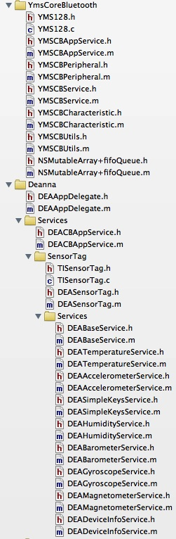

<link rel="stylesheet" type="text/css" href="css/book.css" />

# YmsCoreBluetooth Tutorial

**YmsCoreBluetooth** is a framework for building Bluetooth LE capability to an iOS app. It extends the CoreBluetooth framework by implementing functionality to manage BLE peripherals, their services, and the characteristics of those services. 

The communication patterns used by **YmsCoreBluetooth** are as follows:

* Notifications are handled by implementing a handler method.

* Read/Write requests are handled using callback functions implemented as ObjectiveC blocks.

This tutorial will describe how to build a Bluetooth LE peripheral driver based on YmsCoreBluetooth.

# Building a *SensorTag* Peripheral

Shown below is a partial file hierarchy of *Deanna* to help illustrate the organization and construction of TI SensorTag peripheral using the **YmsCoreBluetooth** framework. There are two directories of interest:

* `YmsCoreBluetooth/` which contains all files for this framework
* `Deanna/Services/` which contains an implementation of the *SensorTag* peripheral

With the above figure, let's walk through building a *SensorTag* peripheral.

## Subclass YMSCBAppService

The class DEACBAppService in `Deanna/Services/DEACBAppService.[hm]` is an application service to manage all known peripherals as defined by you the implementer. In this case we're only concerning ourselves with *SensorTag* peripherals.
It is typically implemented as a singleton instance and contains the following three method implementations:

* `sharedService`
* `startScan`
* `handleFoundPeripheral`

The `sharedService` method is a singleton constructor for `DEACBAppService`. In this implementation, the property `[YMSCBAppService knownPeripheralNames]` is set using `initWithKnownPeripheralNames:queue:` to help identify and filter the peripherals you care to communicate with.

    + (DEACBAppService *)sharedService {
        if (sharedCBAppService == nil) {
            NSArray *nameList = @[@"TI BLE Sensor Tag", @"SensorTag"];
            sharedCBAppService = [[super allocWithZone:NULL] initWithKnownPeripheralNames:nameList
                                                                                    queue:nil];
        }
        return sharedCBAppService;
    }

The `startScan` method lets you define how to go about scanning for peripherals. Within its implementation should be a call to `scanForPeripheralsWithServices:options:` to tell the `CBCentralManager` instance to start scanning.

    - (void)startScan {
        NSDictionary *options = @{ CBCentralManagerScanOptionAllowDuplicatesKey: @YES };
        [self scanForPeripheralsWithServices:nil options:options];
    }

The `handleFoundPeripheral:` method defines what to do once you've found a peripheral via scanning. In the case of a *SensorTag* it is to instantiate `DEASensorTag`, a subclass of `YMSCBPeripheral`. 

    - (void)handleFoundPeripheral:(CBPeripheral *)peripheral {

        YMSCBPeripheral *yp = [self findPeripheral:peripheral];

        if (yp == nil) {
            BOOL isUnknownPeripheral = YES;
            for (NSString *pname in self.knownPeripheralNames) {
                if ([pname isEqualToString:peripheral.name]) {
                    DEASensorTag *sensorTag = [[DEASensorTag alloc] initWithPeripheral:peripheral
                                                                                baseHi:kSensorTag_BASE_ADDRESS_HI
                                                                                baseLo:kSensorTag_BASE_ADDRESS_LO
                                                                            updateRSSI:YES];
                    [self.ymsPeripherals addObject:sensorTag];
                    isUnknownPeripheral = NO;
                    break;

                }

            }

            if (isUnknownPeripheral) {
                //TODO: Handle unknown peripheral
                yp = [[YMSCBPeripheral alloc] initWithPeripheral:peripheral baseHi:0 baseLo:0 updateRSSI:NO];
                [self.ymsPeripherals addObject:yp];
            }
        }

    }

When a BLE peripheral is discovered it can be connected to. The method `[YMSCBAppService connectPeripheral:]` will request this connection and the response is handled by `[YMSCBAppService centralManager:didConnectPeripheral:]`. In this last method, the call to discover the BLE services and subquently each service's characteristics is called. 

## Subclass YMSCBPeripheral

The class implementation of `DEASensorTag` in `Deanna/Services/SensorTag/DEASensorTag.[hm]` is where the top-level behavior of the *SensorTag* peripheral is captured. Two methods are implemented:

* `initWithPeripheral:baseHi:baseLo:updateRSSI:` - the constructor for DEASensorTag
* `peripheral:didDiscoverCharacteristicsForService:error:` - CBPeriperhalDelegate method to handle what to do when BLE characteristics of the BLE services are discovered for a *SensorTag*.

## Constructing DEASensorTag

The class constructor for `DEASensorTag` is responsible for instantiating subclasses of `YMSCBService` to capture the behavior of the different BLE services offered by the *SensorTag*. The source for this constructor, `initWithPeripheral:baseHi:baseLo:updateRSSI:` is shown below:

    - (id)initWithPeripheral:(CBPeripheral *)peripheral
                      baseHi:(int64_t)hi
                      baseLo:(int64_t)lo
                  updateRSSI:(BOOL)update {

        self = [super initWithPeripheral:peripheral baseHi:hi baseLo:lo updateRSSI:update];

        if (self) {

            DEATemperatureService *ts = [[DEATemperatureService alloc] initWithName:@"temperature" baseHi:hi baseLo:lo];
            DEAAccelerometerService *as = [[DEAAccelerometerService alloc] initWithName:@"accelerometer" baseHi:hi baseLo:lo];
            DEASimpleKeysService *sks = [[DEASimpleKeysService alloc] initWithName:@"simplekeys" baseHi:hi baseLo:lo];
            DEAHumidityService *hs = [[DEAHumidityService alloc] initWithName:@"humidity" baseHi:hi baseLo:lo];
            DEABarometerService *bs = [[DEABarometerService alloc] initWithName:@"barometer" baseHi:hi baseLo:lo];
            DEAGyroscopeService *gs = [[DEAGyroscopeService alloc] initWithName:@"gyroscope" baseHi:hi baseLo:lo];
            DEAMagnetometerService *ms = [[DEAMagnetometerService alloc] initWithName:@"magnetometer" baseHi:hi baseLo:lo];
            DEADeviceInfoService *ds = [[DEADeviceInfoService alloc] initWithName:@"devinfo" baseHi:hi baseLo:lo];

            self.serviceDict = @{@"temperature": ts,
                                 @"accelerometer": as,
                                 @"simplekeys": sks,
                                 @"humidity": hs,
                                 @"magnetometer": ms,
                                 @"gyroscope": gs,
                                 @"barometer": bs,
                                 @"devinfo": ds};

            [sks turnOn];
        }
        return self;

    }

In this implementation, the following BLE services of the *SensorTag* are supported:

* Temperature Service - DEATemperatureService
* Accelerometer Service - DEAAccelerometerService
* Simple Keys Service - DEASimpleKeysService
* Humidity Service - DEAHumidityService
* Barometer Service - DEABarometerService
* Gyroscope Service - DEAGyroscopeService
* Magnetometer Service - DEAMagnetometerService
* Device Information Service - DEADeviceInfoService

The instances of these classes are stored in [YMSCBPeripheral serviceDict].

If you wish to perform specific actions upon the discovery of a BLE characteristic, this can be implemented in `peripheral:didDiscoverCharacteristicsForService:error` as shown below:

    - (void)peripheral:(CBPeripheral *)peripheral didDiscoverCharacteristicsForService:(CBService *)service error:(NSError     *)error {

        [super peripheral:peripheral didDiscoverCharacteristicsForService:service error:&*error];

        DEABaseService *btService = (DEABaseService *)[self findService:service];

        if ([btService.name isEqualToString:@"simplekeys"]) {
            [btService setNotifyValue:YES forCharacteristicName:@"data"];

        } else if ([btService.name isEqualToString:@"devinfo"]) {
            DEADeviceInfoService *ds =  (DEADeviceInfoService *)btService;
            [ds readDeviceInfo];

        } else {
            [btService requestConfig];
        }

    }

## Define BLE services of this peripheral.

The BLE services of a peripheral are described by using subclasses of `YMSCBService`. For the *SensorTag*, all but the device information service (DEADeviceInfoService) are subclassed from `DEABaseService` which has support for common configuration and turn on/off behavior.

This subclass is responsible for implementing:

* Properties that are specific to the bluetooth service.
* The class constructor `[YMSCBService initWithName:baseHi:baseLo:]`, defining the BLE characteristics with subclasses of `YMSCBCharacteristic`.
* `notifyCharacteristicHandler` to handle responses for characteristics whose notifications have been turned on.
* Any processing logic germane to the BLE service (e.g. temperature conversion, data correction/smoothing, etc.).
* Specific read/write transaction sequences germane to the BLE service.

Shown below is the implementation for DEAAccelerometerService.

    float calcAccel(int16_t rawV) {
        float v;
        v = ((float)rawV + 1.0) / (256.0/4.0);
        return v;
    }

    @implementation DEAAccelerometerService

    - (id)initWithName:(NSString *)oName
                baseHi:(int64_t)hi
                baseLo:(int64_t)lo {
        self = [super initWithName:oName
                            baseHi:hi
                            baseLo:lo];

        if (self) {
            [self addCharacteristic:@"service" withOffset:kSensorTag_ACCELEROMETER_SERVICE];
            [self addCharacteristic:@"data" withOffset:kSensorTag_ACCELEROMETER_DATA];
            [self addCharacteristic:@"config" withOffset:kSensorTag_ACCELEROMETER_CONFIG];
            [self addCharacteristic:@"period" withOffset:kSensorTag_ACCELEROMETER_PERIOD];
        }
        return self;
    }

    - (void)notifyCharacteristicHandler:(YMSCBCharacteristic *)yc error:(NSError *)error {

        if (error) {
            return;
        }

        if ([yc.name isEqualToString:@"data"]) {
            NSData *data = yc.cbCharacteristic.value;

            char val[data.length];
            [data getBytes:&val length:data.length];

            int16_t xx = val[0];
            int16_t yy = val[1];
            int16_t zz = val[2];

            self.x = [NSNumber numberWithFloat:calcAccel(xx)];
            self.y = [NSNumber numberWithFloat:calcAccel(yy)];
            self.z = [NSNumber numberWithFloat:calcAccel(zz)];

        }
    }

    @end

The class constructor `initWithName:baseHi:baseLo:` defines four BLE characteristics using `addCharacteristic:withOffset:` which we can reference with the following four strings: ("service", "data", "config", "period").

When the service is turned on using the method [DEABaseService turnOn], notifications for the "data" characteristic are turned on. Handling notification events sent from the *SensorTag* are handled by `notifyCharacteristicHandler`. The acceleration measurements are stored as `NSNumber` properties `x`, `y`, `z`. These properties can then be Key-Value Observed (KVO) by the application, typically to be displayed in user interface.

# Comments
This document can always be improved. Please submit any comments or corrections about this document to the [issue tracker](https://github.com/kickingvegas/YmsCoreBluetooth/issues?state=open) for **YmsCoreBluetooth**.

Thank you for using **YmsCoreBluetooth**!

